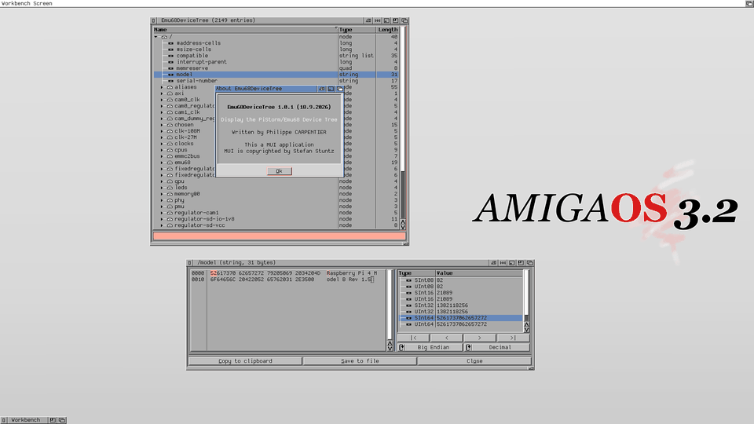
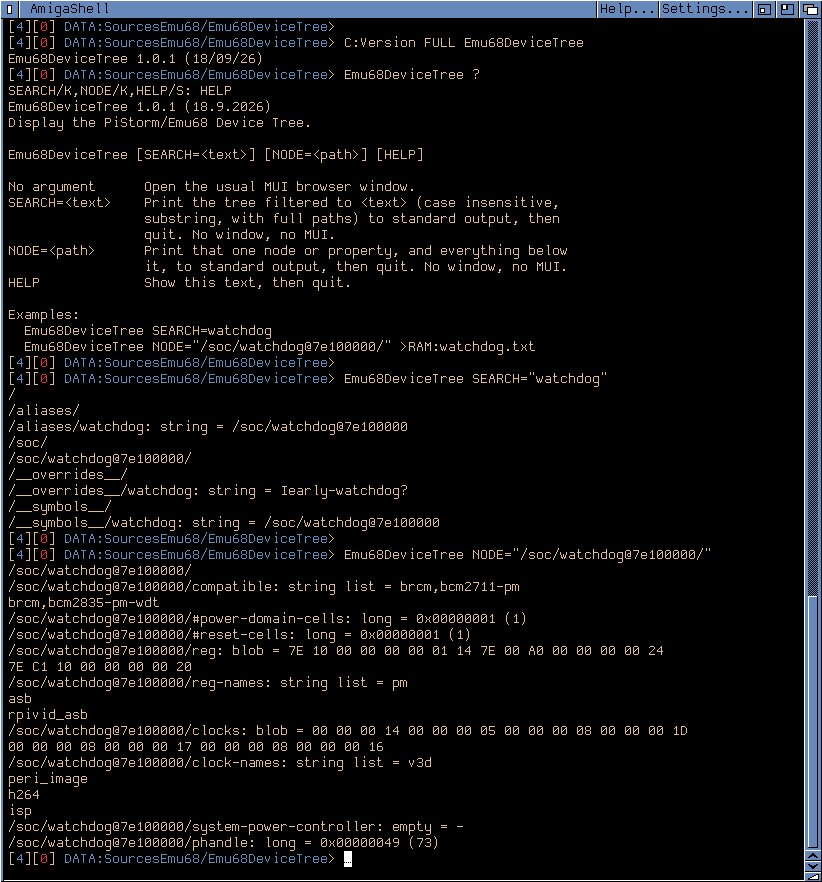

# Emu68DeviceTree

**Display the PiStorm/Emu68 Device Tree.**

Emu68DeviceTree is a [MUI](http://muidev.de/) browser for the Device Tree published
by [Emu68](https://github.com/michalsc/Emu68) on PiStorm boards. It is meant for the
lowlevel PiStorm/Emu68 developer who needs to see, decode and extract what
`devicetree.resource` holds, without leaving AmigaOS.

- **Version:** 1.0.1
- **Author:** Philippe CARPENTIER (flype44 *at* gmail)
- **Architecture:** m68k-amigaos >= 3.0.0
- **Distribution:** [Aminet](http://aminet.net/) — `util/moni`

## Screenshot


## Screenshot GIF :


## Features

- **Tree browser** — the whole device tree as a MUI NListtree, with a *Name*,
  *Type* and *Length* column. Click a column title to sort by it, click again to
  reverse the order. *Expand All* / *Collapse All* from the Tree menu.
- **Search** — a gadget at the bottom of the main window, shown or hidden from
  the Tree menu. Press RETURN to filter the tree down to the nodes and
  properties whose name contains the text (case insensitive), keeping their
  parents for context; clear it and press RETURN again to show everything.
- **Type detection** — each property is classified as `empty`, `string`,
  `string list`, `long`, `quad` or `blob`, from its length and its content.
- **Hexadecimal dump** — double-click a property to open the information window,
  which shows the raw bytes of the property as they lie in `devicetree.resource`,
  through a read-only subclass of MCC_HexEdit.
- **Data Inspector** — the value under the dump cursor read as `SInt08`, `UInt08`,
  `SInt16`, `UInt16`, `SInt32`, `UInt32`, `SInt64`, `UInt64` and as a Unix epoch,
  in Big or Little Endian, in binary, octal, decimal or hexadecimal.
- **Copy to clipboard** — the value of the entry, shaped after its type (the
  string itself, one string per line for a string list, sixteen bytes per line
  for a blob, the path for a node), written as an IFF `FTXT`/`CHRS` form that
  every Amiga text application reads. Double-click a Data Inspector row to copy
  that single cell instead.
- **Save to file** — the raw bytes of the property, byte for byte, to feed a
  disassembler or `dtc`. Suggests a `.raw` file name.
- **Save node as...** — the selected node or property, and everything below it,
  to a plain text file (select the root `/` to dump the whole tree). Respects
  an active search: only what the filtered tree shows gets written. *Use full
  names* prefixes every line with the entry's full path instead of indenting,
  which makes the export easier to `grep`.
- **Reload** — rebuild the tree from the resource at any time, clearing any
  active search first.
- **Command line** — `SEARCH=` or `NODE=` skip the GUI entirely and write to
  standard output instead, for remote sessions and scripting. See
  *Command line* below.
- Iconification, MUI settings, and the usual MUI configurability.

## Requirements

- **AmigaOS 3.0** or better. Nothing newer than V36 is called.
- A machine exposing the **`devicetree.resource`**. In practice, a PiStorm board
  running Emu68.
- **MUI 3.8** or better —
  [util/libs/mui38usr](http://aminet.net/package/util/libs/mui38usr)
- **MCC_NList, MCC_NListview, MCC_NListtree** —
  [dev/mui/MCC_NList-0.128](http://aminet.net/package/dev/mui/MCC_NList-0.128)
- **MCC_HexEdit**, by Miloslaw Smyk —
  [dev/mui/MCC_HexEdit](http://aminet.net/package/dev/mui/MCC_HexEdit)

Without MCC_HexEdit the program still runs: the dump area simply states that the
class is not installed.

## Installation

Copy `Emu68DeviceTree` wherever you like. The program needs no assign and no
configuration file; its settings are the MUI ones, reachable from the Project
menu. A command line argument is optional — see *Command line* below.

## Usage

Run the program from the Shell or from Workbench.

### Workbench

The **Project** menu holds *Reload...*, *Save node as...*, *Use full names*,
*About...*, *About MUI...*, *Settings MUI...*, *Iconify* and *Quit*. The
**Tree** menu holds *Expand All*, *Collapse All* and *Show search gadget*.

### Command line

Give the program `SEARCH=` or `NODE=` and it never opens a window, never even
touches MUI: it writes to standard output and quits, so the result can be
read directly or redirected to a file.

```
Emu68DeviceTree SEARCH=watchdog
Emu68DeviceTree NODE="/soc/watchdog@7e100000/" >RAM:watchdog.txt
Emu68DeviceTree NODE="/soc/watchdog@7e100000/phandle"
```

`SEARCH=` filters the tree exactly as the search gadget would (case
insensitive, with full paths), keeping matches' parents for context — handy
to find a node's path from a remote session. `NODE=` then dumps that one
node (or property) whole, in full, exactly like selecting it in the tree and
using *Save node as...*. A typical remote session runs `SEARCH=` first to
find the interesting path, then `NODE=` to pull it. Quoting the value is
only needed when it contains spaces or slashes the Shell would otherwise
parse.

`HELP` prints this same summary and quits — the usual `Emu68DeviceTree ?`
shows the `SEARCH/K,NODE/K,HELP/S` template first, which is where `HELP`
comes from.



## Credits

Written by Philippe CARPENTIER.

MUI is copyrighted by Stefan Stuntz. MCC_NList and friends are by the NList Open
Source Team. MCC_HexEdit is by Miloslaw Smyk. Emu68 is by Michal Schulz. PiStorm
is designed by Claude Schwarz.
