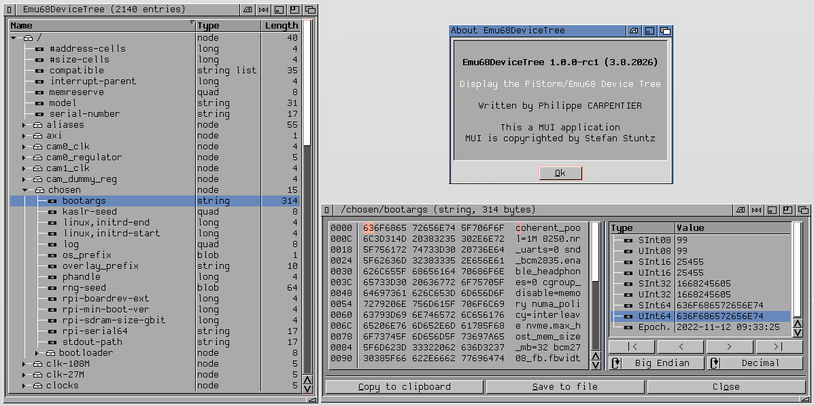

# Emu68DeviceTree

**Display the PiStorm/Emu68 Device Tree.**

Emu68DeviceTree is a [MUI](http://muidev.de/) browser for the Device Tree published
by [Emu68](https://github.com/michalsc/Emu68) on PiStorm boards. It is meant for the
lowlevel PiStorm/Emu68 developer who needs to see, decode and extract what
`devicetree.resource` holds, without leaving AmigaOS.

- **Version:** 1.0.0-rc1
- **Author:** Philippe CARPENTIER (flype44 *at* gmail)
- **Architecture:** m68k-amigaos >= 3.0.0
- **Distribution:** [Aminet](http://aminet.net/) — `util/moni`




## Features

- **Tree browser** — the whole device tree as a MUI NListtree, with a *Name*,
  *Type* and *Length* column. Click a column title to sort by it, click again to
  reverse the order. *Expand All* / *Collapse All* from the Tree menu.
- **Type detection** — each property is classified as `empty`, `string`,
  `string list`, `long`, `quad` or `blob`, from its length and its content.
- **Hexadecimal dump** — double-click a property to open the information window,
  which shows the raw bytes of the property as they lie in `devicetree.resource`,
  through a read-only subclass of MCC_HexEdit.
- **Data Inspector** — the value under the dump cursor read as `SInt08`, `UInt08`,
  `SInt16`, `UInt16`, `SInt32`, `UInt32`, `SInt64`, `UInt64` and as a Unix epoch,
  in Big or Little Endian, in binary, octal, decimal or hexadecimal.
- **Copy to clipboard** — the value of the entry, shaped after its type (the
  string itself, one string per line for a string list, sixteen bytes per line
  for a blob, the path for a node), written as an IFF `FTXT`/`CHRS` form that
  every Amiga text application reads. Double-click a Data Inspector row to copy
  that single cell instead.
- **Save to file** — the raw bytes of the property, byte for byte, to feed a
  disassembler or `dtc`.
- **Reload** — rebuild the tree from the resource at any time.
- Iconification, MUI settings, and the usual MUI configurability.

## Requirements

- **AmigaOS 3.0** or better. Nothing newer than V36 is called.
- A machine exposing the **`devicetree.resource`**. In practice, a PiStorm board
  running Emu68.
- **MUI 3.8** or better —
  [util/libs/mui38usr](http://aminet.net/package/util/libs/mui38usr)
- **MCC_NList, MCC_NListview, MCC_NListtree** —
  [dev/mui/MCC_NList-0.128](http://aminet.net/package/dev/mui/MCC_NList-0.128)
- **MCC_HexEdit**, by Miloslaw Smyk —
  [dev/mui/MCC_HexEdit](http://aminet.net/package/dev/mui/MCC_HexEdit)

Without MCC_HexEdit the program still runs: the dump area simply states that the
class is not installed.

## Installation

Copy `Emu68DeviceTree` wherever you like. The program needs no assign, no
configuration file and no argument. Its settings are the MUI ones, reachable from
the Project menu.

## Usage

Run the program from the Shell or from Workbench.

| Action | How |
| --- | --- |
| Sort by a column | Click its title; click again to reverse |
| Expand / collapse the whole tree | `E` / `C`, or the Tree menu |
| Open the information window | Double-click a property |
| Move the dump cursor | `|<` `<` `>` `>|`, or the keyboard inside the dump |
| Copy the value | *Copy to clipboard*, or `C` |
| Copy one inspector cell | Double-click the row |
| Save the raw bytes | *Save to file*, or `S` |
| Reload the tree | `L`, or the Project menu |
| Iconify | `I` |
| Quit | `Q`, or `Ctrl-C` from the Shell |

`Ctrl-E` and `Ctrl-F` bring the program back from iconified state.

## Building

The program is written in **strict ANSI C89** and builds with **SAS/C 6.59** on
AmigaOS, against the **NDK 3.2** includes and the MUI 3.8 / MCC developer
includes.

```
smake
```

`SCOPTIONS` targets `CPU=68020`, which every PiStorm board satisfies. Set it to
`CPU=68000` if you want a plain 68000 binary.

`smake clean` deletes the object files.

### Source layout

| File | Contents |
| --- | --- |
| `Emu68DeviceTree.c` | Application, MUI interface, hooks and event loop |
| `Emu68DeviceTree.h` | Application constants, events, object structure |
| `DeviceTree.c/.h` | `devicetree.resource` structures, typing and formatting |
| `Clipboard.c/.h` | The writer: IFF clipboard plumbing and plain files |
| `Utils.c/.h` | Strings, `RawDoFmt()` wrapper, number and date formatting |
| `SMakefile` | SAS/C makefile |
| `SCOPTIONS` | SAS/C compiler options |

## Contributing

Issues and pull requests are welcome at
<https://github.com/flype44/Emu68DeviceTree/>.

Please keep to the existing style: strict C89, SAS/C 6.59 clean, no C++ comments,
no dependency beyond the NDK, MUI 3.8 and the MCCs listed above, and no OS call
newer than V36.

## Credits

Written by Philippe CARPENTIER.

MUI is copyrighted by Stefan Stuntz. MCC_NList and friends are by the NList Open
Source Team. MCC_HexEdit is by Miloslaw Smyk. Emu68 is by Michal Schulz.
